# How to manage tankaraca.com

This is your complete guide to the Housey admin page. Every action you can take is here, with a screenshot of exactly what you'll see.

The admin page lives at **<https://www.tankaraca.com/admin>**. Bookmark it.

---

## 1. Logging in

Go to <https://www.tankaraca.com/admin> in any browser.

Type your password (the same one you've been using), then click **Login**.

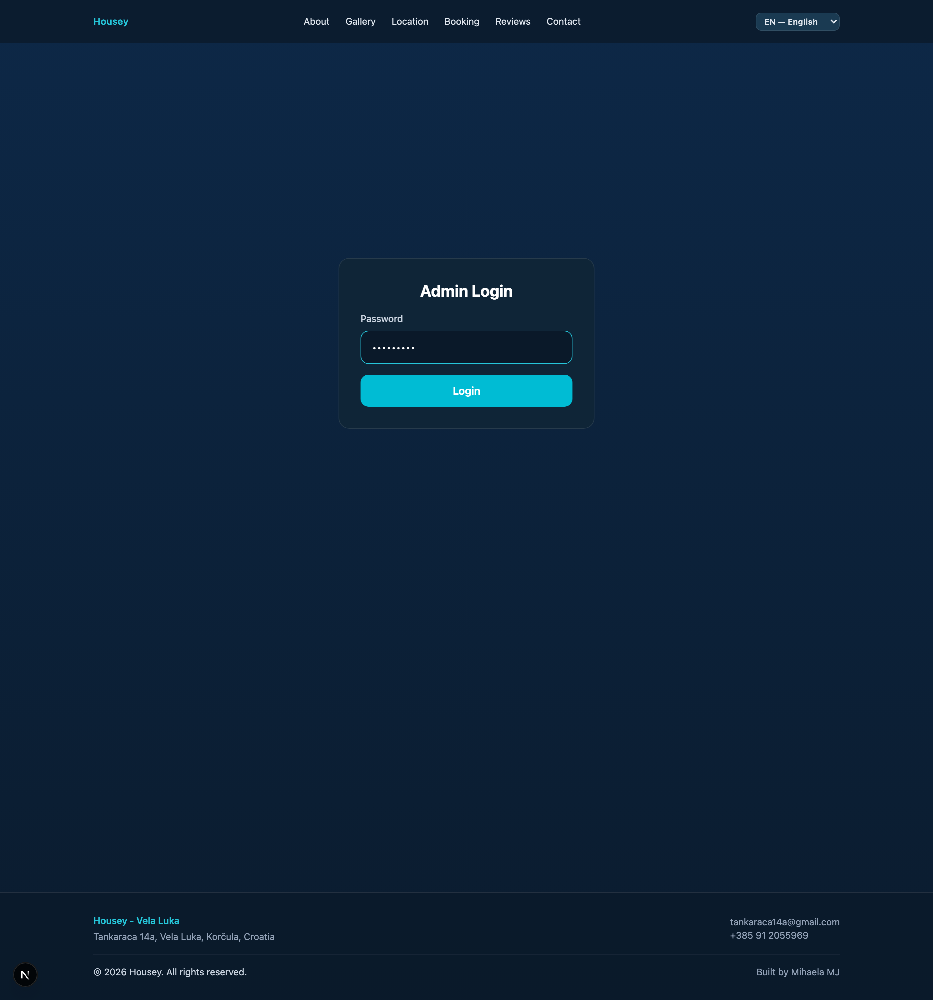

> **Tip:** The page knows your language. There's a small **HR/EN** button in the top-right corner — click it to switch between Croatian and English at any time.

---

## 2. The admin page at a glance

Once you're logged in, you'll see one big page with four sections:

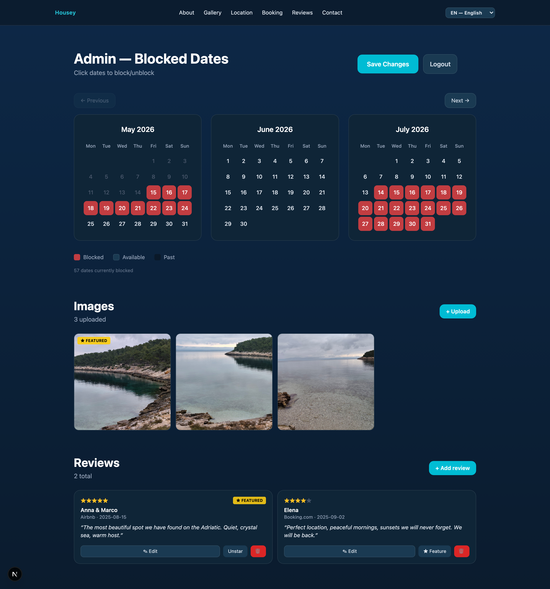

1. **The Calendar at the top** — for blocking dates when you'll be using the house yourself.
2. **Images** — to upload and manage the photos on the public site.
3. **Reviews** (scroll down) — quotes from past guests, with star ratings, that you publish on the public site.
4. **Bookings** (scroll further down) — every reservation from guests, plus a way to add your own.

You can scroll the whole page — nothing is hidden behind buttons or menus.

---

## 3. Blocking dates on your own calendar

Use this when **you** are going to be at the house and don't want guests to book. The dates you mark stay blocked until you remove them.

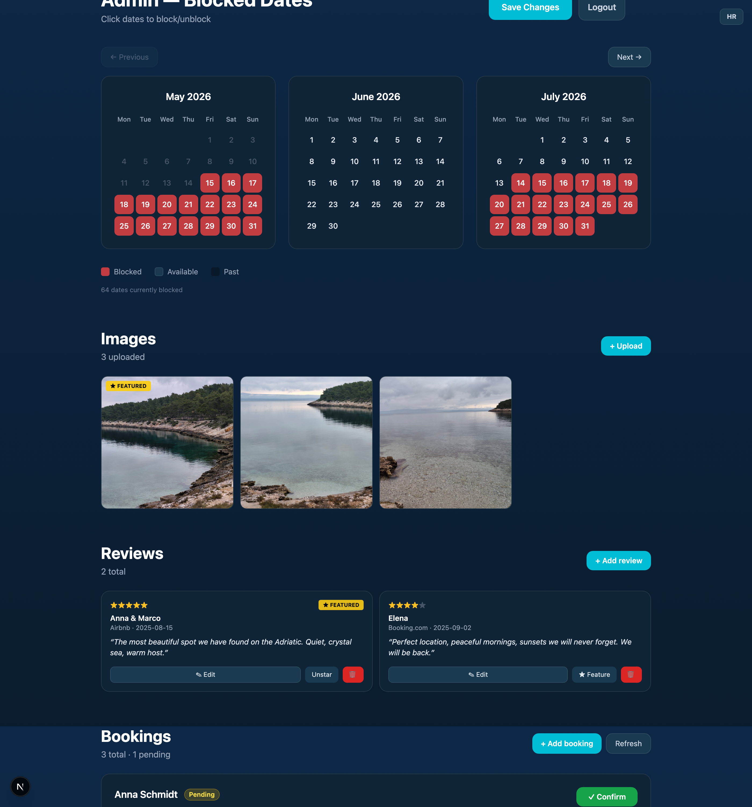

**To block a date:** click any future day. It turns red.

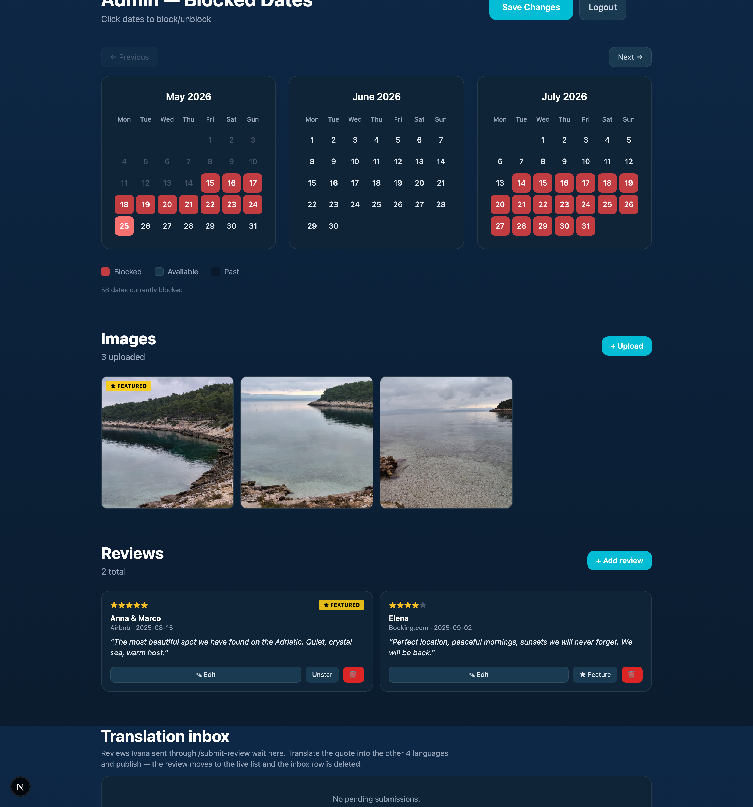

**To unblock a date:** click a red day. It turns back to normal.

**You can mark multiple dates before saving.** Use the **← Previous** / **Next →** buttons to scroll through months — you can go as far into the future as you need.

When you're done, click the big **Save Changes** button at the top right. A green **"Changes saved!"** message confirms:

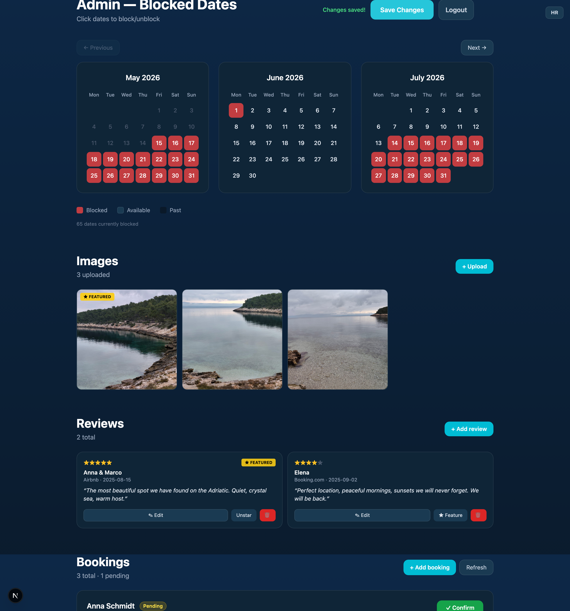

> **What guests see:** Blocked dates show as strike-through with an "Unavailable" tooltip on the booking page. Guests cannot select them.

---

## 4. Guest bookings

Every reservation a guest submits through the website lands here, with status **Pending**. You decide what happens next.

Each booking shows:
- **Guest name + status badge** (Pending / Confirmed / Declined)
- **Email** (clickable — opens your email app to reply)
- **Phone**
- **Check-in and check-out dates**
- **Number of guests**
- **Their message to you**
- **When they submitted it**

### 4.1 Confirming a booking

Every pending booking has these buttons on the right:

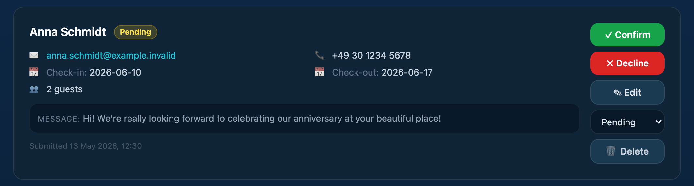

Click the green **✓ Confirm** button to accept the reservation.

You will see **two confirmation dialogs in a row** before anything actually happens, so you can't accidentally confirm:

1. *"Confirm this booking?"* → click **OK** to proceed
2. *"This will EMAIL the guest that their booking is CONFIRMED and block these dates: [guest name + dates]"* → click **OK** if you're sure

After both OKs, the booking row immediately shows **Confirmed** (green badge), the ✓ Confirm and ✗ Decline buttons disappear, and an **Undo** toast slides in at the bottom-right with a 10-second countdown:

During those 10 seconds, nothing has actually been sent to the guest yet, and no calendar dates have been blocked. You can:

- **Click Undo** within 10 seconds → the booking goes back to Pending, no email is sent, no dates are blocked. Like the click never happened.
- **Wait 10 seconds** (or just walk away) → three things then happen automatically:
  - The booking status is saved as **Confirmed** on the server
  - The dates of the stay are added to your blocked calendar (so no other guest can book the same nights)
  - An email is sent to the guest with their booking confirmation, including the check-in/check-out times and the property address

> **Important:** Once the 10-second window passes, the email is sent and cannot be unsent. If you're not sure, click Undo and take another look at the booking first.

### 4.2 Declining a booking

Same pattern, but click the red **✗ Decline** button:

1. *"Decline this booking?"* → **OK**
2. *"This will EMAIL the guest that their booking is declined: [guest name + dates]"* → **OK**

The row shows **Declined** (red badge), the action buttons disappear, and an **Undo** toast appears at the bottom-right with a 10-second countdown:

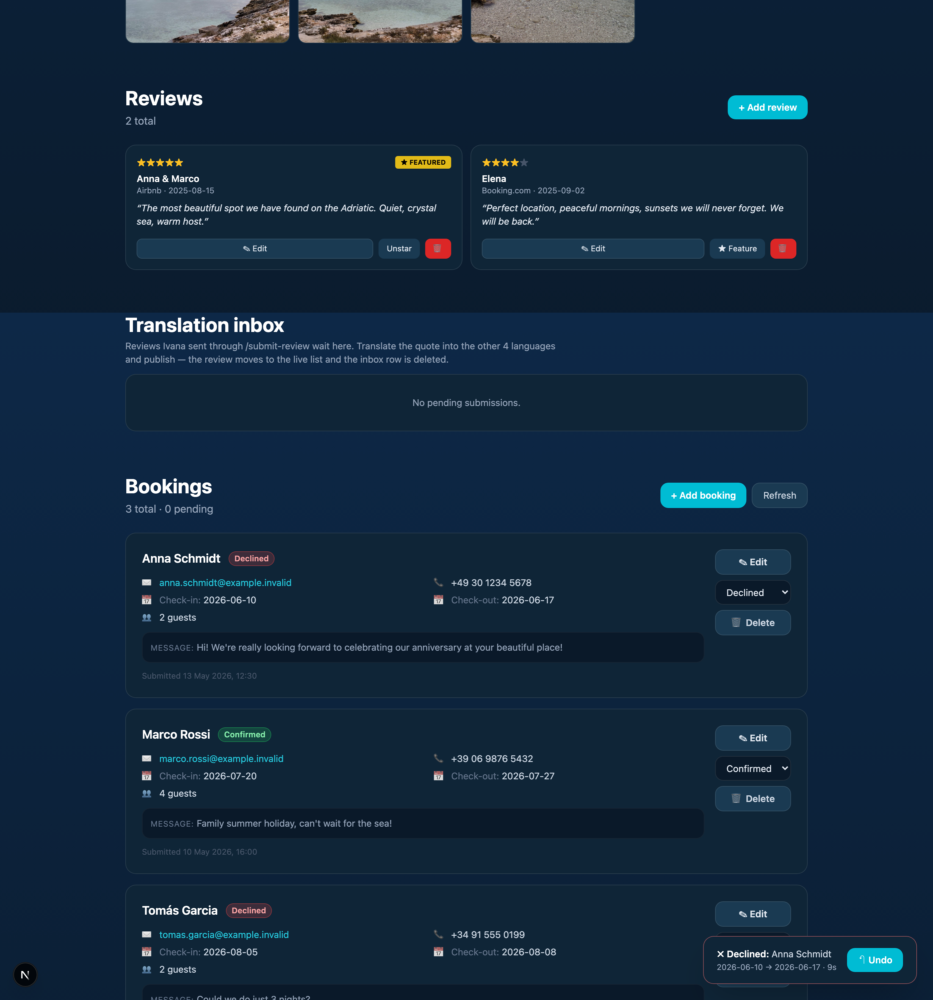

- **Click Undo within 10 seconds** → back to Pending, no email sent.
- **Wait 10 seconds** → the status is saved and the guest receives a polite "we can't accommodate you, please try different dates" email.

> Declined bookings stay in the list (so you have a record), but they don't reserve the calendar. Someone else can book the same dates.

### 4.3 Editing booking details

Sometimes you need to fix a typo, shift the dates after a phone conversation, or update the guest's message. Click the **✎ Edit** button on any row.

A form appears with every field editable:

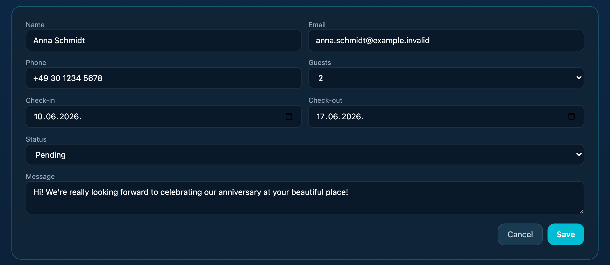

Change anything — name, email, phone, dates, guest count, status, or the message — then click **Save**.

> **Undo:** After saving, a small toast appears at the bottom-right corner with an **Undo** button. You have **10 seconds** to click it if you saved by mistake — the booking will revert to exactly how it was. After 10 seconds, the change is permanent.

### 4.4 Changing status freely

Each row also has a small status dropdown:

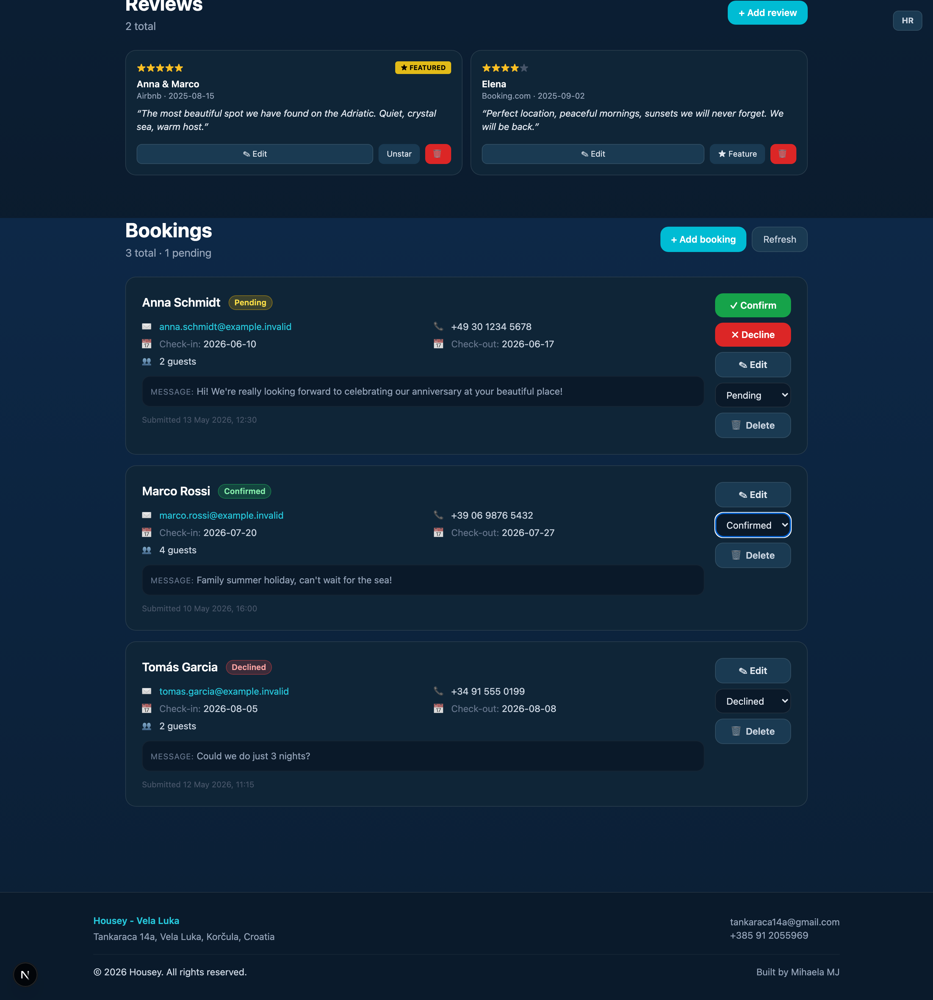

You can switch any booking between Pending / Confirmed / Declined in **any direction** — for example, if you accidentally confirmed and want to switch it back to pending.

> **Difference vs the Confirm button:** This dropdown only changes the status. It does NOT send any email and does NOT touch the blocked calendar. Use it for corrections; use the green Confirm button when you actually want to notify the guest.

### 4.5 Adding a manual booking (phone reservations)

When someone calls or texts to book, click the **+ Add booking** button at the top of the bookings section.

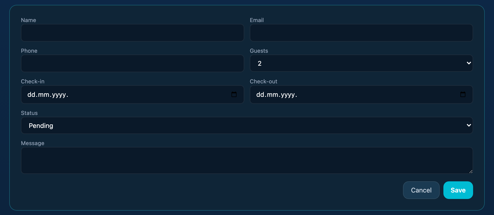

Fill in everything you know, pick a starting status (Pending if you want to confirm later, Confirmed if it's already a sure thing), click **Save**.

> Manual bookings don't trigger the confirmation email. If you want the guest to get one anyway, email them yourself or change the status to Pending and then click the green **✓ Confirm** button.

### 4.6 Deleting a booking

The 🗑 **Delete** button is on every row, no matter the status. It's protected by **two confirmations AND a 10-second undo**:

1. *"Delete this booking?"* → **OK**
2. *"Are you sure you want to permanently delete the booking for: [guest name + dates]"* → **OK**

The row immediately disappears from the list, AND a toast appears at the bottom-right with a countdown and an **Undo** button:

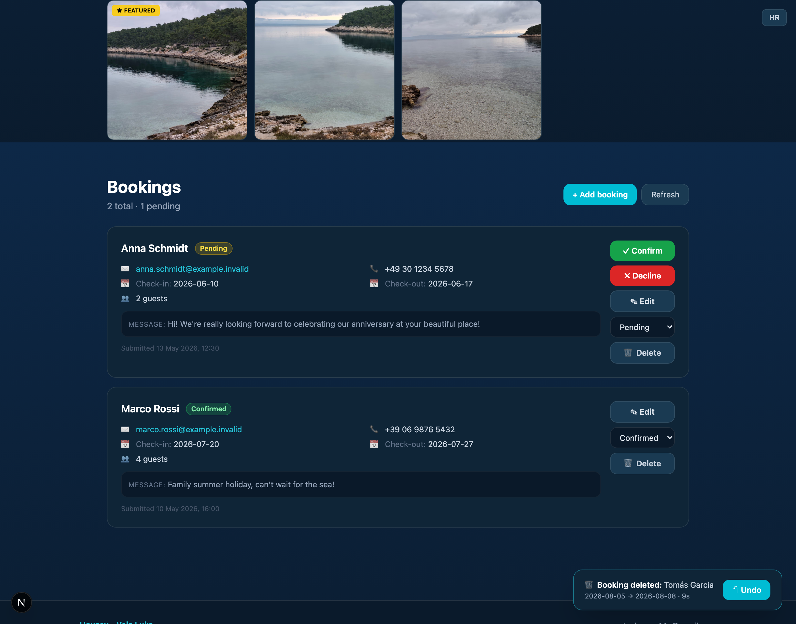

- **Click Undo within 10 seconds** → the booking comes back, exactly as it was. No email, no permanent change.
- **Wait 10 seconds** → the booking is permanently removed.

> **Important quirk:** If the booking was Confirmed, deleting it does NOT free up the calendar dates automatically. This is a safety feature so a misclick can't accidentally re-open a paying guest's nights. To free the dates: click them off in the calendar at the top of the page and Save Changes.

---

## 5. Photos

Photos uploaded here automatically appear on your public **/gallery** page within seconds. No code change, no waiting on a developer.

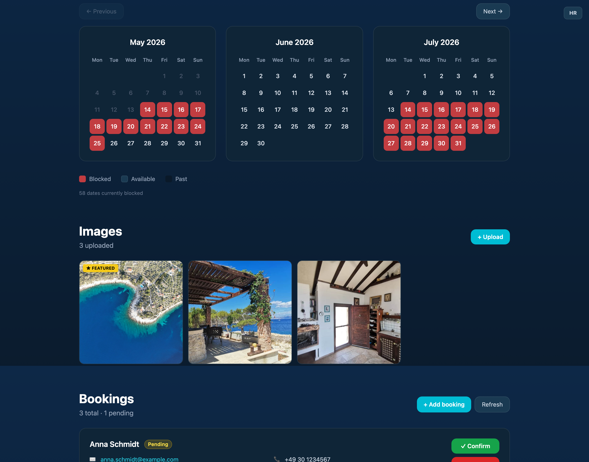

### 5.1 Uploading photos

Click the blue **+ Upload** button.

A file picker opens. You can:
- Pick **one photo or many** at once (hold Cmd/Ctrl while clicking)
- Upload **JPEG, PNG, WebP, or HEIC** (HEIC is what iPhones produce — it gets converted to JPEG automatically in your browser, you don't have to do anything)
- Files up to **12 MB each** are accepted

A counter appears showing "uploading N..." while photos transfer. When the count reaches 0, your photos are live.

### 5.2 Featuring photos

Hover over any photo to reveal its action buttons:

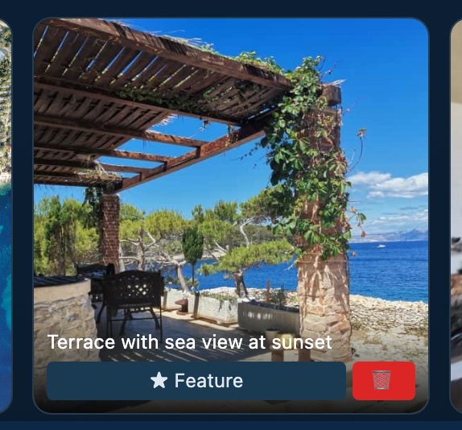

Click **★ Feature** to mark it. Featured photos get a yellow ★ FEATURED badge:

> **Note about featured photos:** The gallery currently shows the first 3 featured photos in a hero layout, and the rest in the main grid. If you have many featured photos, only the first 3 get the hero treatment.

Click **Unstar** to unfeature.

### 5.3 Deleting photos

Click the 🗑 trash button on any photo. You'll see two confirmations:

1. *"Delete this photo?"* → **OK**
2. *"Really delete this photo?"* → **OK**

The photo disappears from the grid immediately, AND an **Undo** toast appears at the bottom-right with a 10-second countdown — exactly like deleting a booking:

- **Click Undo within 10 seconds** → the photo comes back, nothing ever changed.
- **Wait 10 seconds** → the photo is gone for good (bytes removed from storage).

> If you accidentally click 🗑 and don't see the toast straight away, scroll to the bottom-right corner of the page — that's where the undo lives.

---

## 6. Guest reviews

Reviews are real quotes from people who have stayed at the house. You copy them in from wherever they came (Airbnb, Booking.com, a private message, an email) and they appear on your **/reviews** page on the public site. Anything you mark as **Featured** also shows on the home page, so it's the first thing new visitors see.

You are the only person who can add or edit reviews. Guests do NOT leave reviews on your site — they still leave them on Airbnb / Booking / Google like before. You decide which ones to publish here.

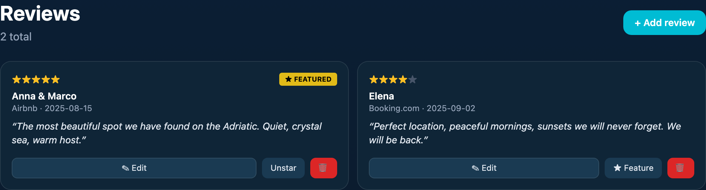

### 6.1 Adding a review

Scroll down to the **Reviews** section (it sits between Images and Bookings) and click the blue **+ Add review** button. A form appears:

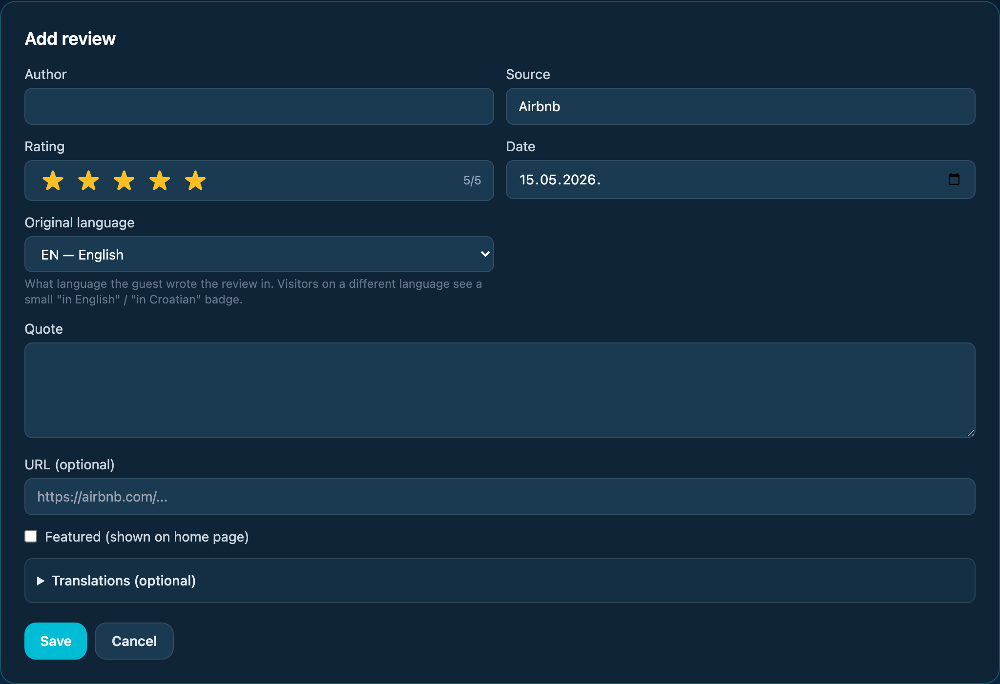

Fill in:

- **Author** — the guest's first name and last initial (e.g. `Anna M.` or `Anna & Marco`). Keep it short — this is all that shows on the public site.
- **Source** — where the review came from. Free text, type whatever helps you remember: `Airbnb`, `Booking.com`, `Direct`, `WhatsApp`, `Email`, `Google`. The field is pre-filled with `Airbnb`; type over it if needed.
- **Rating** — see 6.2 below.
- **Date** — the date the guest left the review. Already filled with today; change it if you remember the original date.
- **Quote** — paste the review text exactly as the guest wrote it. One or two sentences works best — long paragraphs get cut off on phones.
- **URL (optional)** — if the review is published online (Airbnb, Google), paste its link here. Leaving it blank is fine.
- **Featured (shown on home page)** — tick this if you want the review to appear on your front page. Best for your absolute favourites; the home page only highlights a few.

Click **Save**. The review immediately appears in the list above (and on the public site within seconds).

### 6.2 Setting the star rating

You set the rating by clicking on the stars. **A new review starts at 5 stars** (the highest). To give a lower rating, click the star at the position you want:

- Click the **3rd star** → you get a 3-star rating (3 yellow, 2 grey)
- Click the **1st star** → 1-star rating (1 yellow, 4 grey)
- Click the **5th star** → back to 5

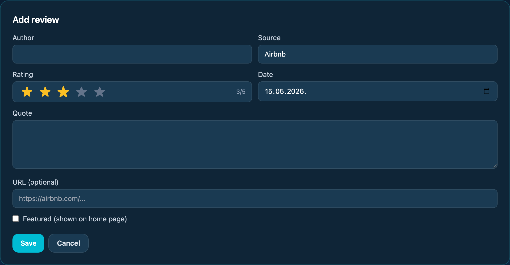

The little **"3/5"** label on the right always confirms the current value. Click any star at any time to change it — you can keep adjusting until it looks right.

> **For Booking.com reviews:** their scores come out of 10. Divide by 2 and round normally — a `9` becomes 5 stars here, an `8` becomes 4, a `7` becomes 4 (round up if the number ends in `.5`).

### 6.3 Featuring a review

Each review tile has three buttons at the bottom: **✎ Edit**, **★ Feature** (or **Unstar** if it's already featured), and **🗑** (delete).

Click **★ Feature** to put the review on the home page. Featured reviews:

- get a small yellow **★ FEATURED** badge on the tile in your admin view
- show up on the home page in a short row of cards above the footer
- still appear on the full **/reviews** page

The home page shows the first three featured reviews. If you mark more than three as featured, the extras only appear on the /reviews page.

Click **Unstar** on a featured review to remove it from the home page. The review itself stays — only the home-page placement is removed.

### 6.4 Editing a review

Click **✎ Edit** on any review tile. The same form opens, pre-filled with what you originally saved. Change anything (the stars too — click on a different star to change the rating). Click **Save** — the review updates immediately, the public site refreshes within seconds.

Click **Cancel** if you opened it by mistake — nothing gets written.

### 6.5 Deleting a review

Click the red **🗑** button on a review tile.

You'll see one confirmation: *"Delete this review by [author]?"* → **OK**.

The review disappears from the list **immediately**, and an **Undo** toast appears in the bottom-right of the screen with a 10-second countdown — same pattern as bookings and photos:

- **Click Undo within 10 seconds** → the review comes back, nothing ever changed.
- **Wait 10 seconds** → the review is permanently gone.

> If you accidentally click 🗑 and don't see the toast right away, scroll to the bottom-right corner of the page — that's where the undo lives.

### 6.6 Reviews in Arabic, Hebrew, Farsi, or other right-to-left scripts

If a guest leaves a review in Arabic, Hebrew, Farsi, or any right-to-left script, **just paste it in like any other quote**. The form auto-detects the direction as you paste, so the text will appear right-aligned in the Author and Quote boxes — you'll see what the public site will see.

On the public **/reviews** page, each card flips independently:

- An English / Croatian / Italian review stays left-aligned, opening quote on the left.
- An Arabic / Hebrew / Farsi review flips to right-aligned, opening quote on the right.
- A mixed-language quote (an Arabic review that mentions "Airbnb" in Latin letters, for example) flows correctly too — the browser figures it out.

There's nothing to toggle, no setting to remember. Paste the text exactly as the guest wrote it and click **Save**.

---

## 7. Switching language

There's a small **language picker** dropdown in the top-right corner of every page (admin and public site alike). The first time anyone opens the site it defaults to **English**. Click the dropdown and pick a language:

- **EN — English** (default)
- **HR — Hrvatski**
- **DE — Deutsch**
- **IT — Italiano**
- **FR — Français**

The choice is remembered on your device (it persists across pages and across browser sessions), so once you pick Croatian you stay in Croatian until you change it again. Visitors get their own remembered choice on their own device.

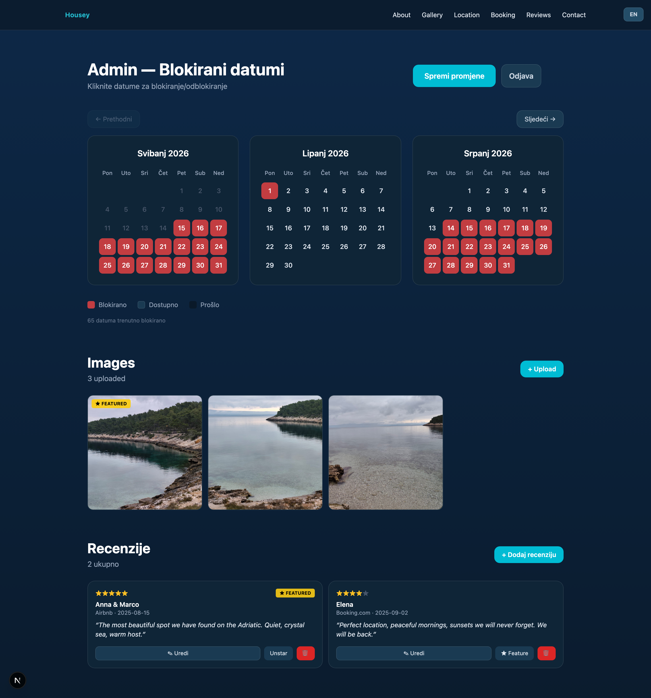

In your admin page everything — calendar labels, button text, status badges, confirmation dialogs — adapts to the chosen language.

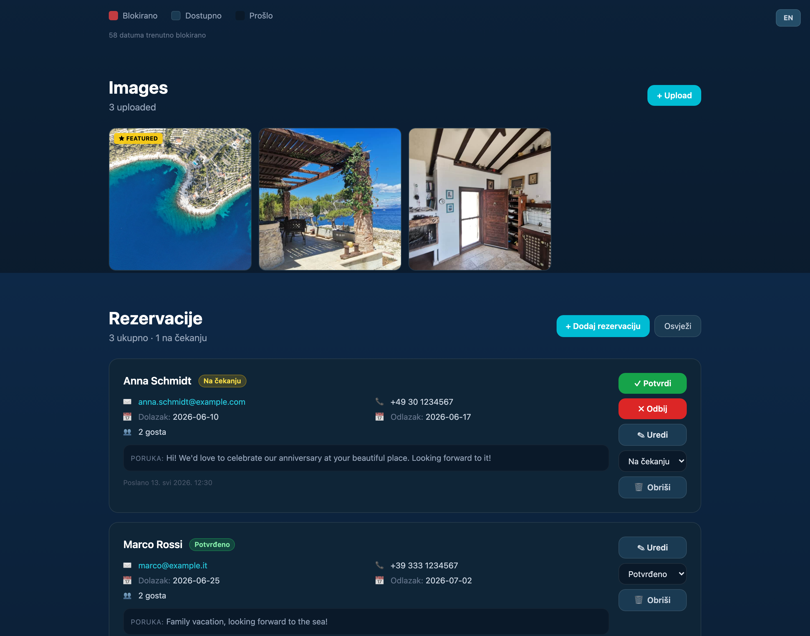

### 7.1 What guests see

The picker also lives on your **public** site (every page — Home, About, Gallery, Booking, Location, Reviews, Contact). A guest visiting from Germany sees German labels, a guest from Italy sees Italian, and so on. The whole site — including the booking calendar's month and day names, the pricing table, every form label, every validation message, every "Send Message" / "Submit Booking Request" button — switches to whichever language the visitor picks.

The visitor's choice is remembered on **their** device, independently of yours. You and a Croatian guest can both have the site open at the same time, you in English, them in Croatian, and neither setting affects the other.

Below: the home page in Croatian, and the booking page in German. Same site, same data, different language for whichever visitor is reading.

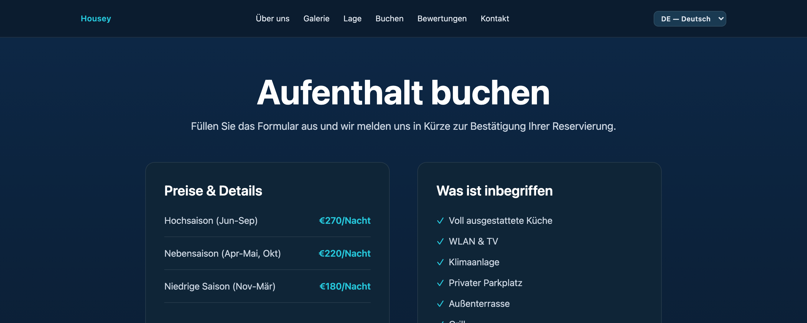

### 7.2 Booking confirmation / decline emails

When a guest fills the booking form, the language they picked is **saved on their booking row** along with their name, dates, and message. When you later click **Confirm** or **Decline** on that booking in the admin, the email goes out in the guest's language automatically:

- A German guest gets `"Ihre Buchung ist bestätigt!"` (or `"Buchungsanfrage aktualisiert"` for decline).
- A French guest gets `"Votre réservation est confirmée !"` / `"Mise à jour de la demande de réservation"`.
- An Italian guest gets `"La tua prenotazione è confermata!"` / `"Aggiornamento sulla richiesta di prenotazione"`.
- A Croatian guest gets `"Vaša rezervacija je potvrđena!"` / `"Ažuriranje zahtjeva za rezervaciju"`.
- An English guest gets the original English template.

You don't pick the language yourself; it's whatever the guest picked when they submitted the form. If the booking pre-dates this feature (older rows) or somehow has no language recorded, the email falls back to English. The Confirm/Decline buttons in the admin behave identically regardless — you just click, and the right language goes out.

The contact-form notifications that you receive in your own inbox are always in **Croatian** (the labels: Ime, E-mail, Predmet, Poruka). The visitor's typed subject and message stay in whatever language they wrote them.

---

## 8. Logging out

Click the **Logout** button (top right).

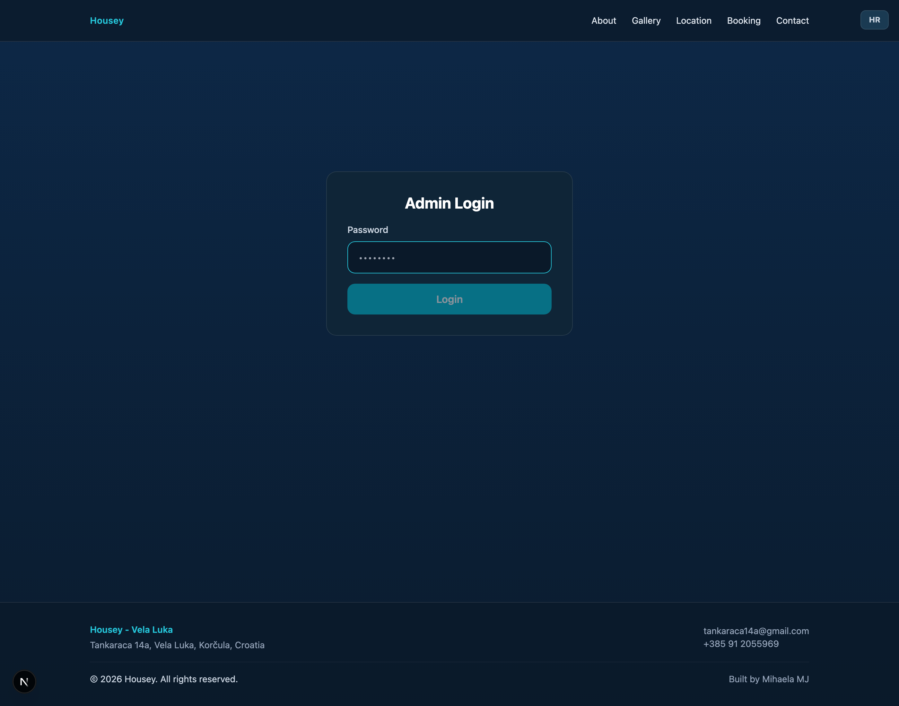

This wipes your password from the browser's memory. Useful if you're on a shared computer.

> **Closing the browser tab** also logs you out — your password is never stored to disk.

---

## 9. What to do if something goes wrong

### "I clicked Confirm on the wrong booking"

- **Within 10 seconds:** click the **Undo** button in the toast at the bottom-right of the screen. No email is sent. No dates are blocked. The booking goes back to Pending.
- **After 10 seconds (email already went out):**
  - The guest has the confirmation email already. You can't unsend it.
  - Email them directly from your own inbox (mailto link is on the booking row) and explain.
  - Use the **status dropdown** to switch the booking back to Pending or Declined.
  - The dates that auto-blocked when you confirmed will still be blocked. Click them off the calendar at the top and Save Changes.

### "I clicked Decline on the wrong one"

- **Within 10 seconds:** click the **Undo** button in the toast at the bottom-right. No email sent.
- **After 10 seconds:** email the guest directly to apologize, then use the status dropdown to switch them back to Pending.

### "I deleted a booking by mistake"

- **Within 10 seconds:** click the **Undo** button in the toast at the bottom-right.
- **After 10 seconds:** the booking is gone. Ask the guest to resubmit via the website, or use **+ Add booking** to recreate it from email/notes.

### "I accidentally blocked the wrong date"

- Click the red date on the calendar again — it turns transparent.
- Click **Save Changes**. That's all.

### "I uploaded the wrong photo"

- Hover the photo, click 🗑, click through both confirmations.
- The photo disappears, an **Undo** toast appears in the bottom-right with a 10-second countdown.
- Wait 10 seconds → it's permanently gone.
- Click Undo within 10 seconds → it comes back.

### "I deleted the wrong photo"

- **Within 10 seconds:** click the **Undo** button in the toast at the bottom-right corner.
- **After 10 seconds:** the photo's bytes are gone from storage. You'll need to re-upload from your phone.

### "I deleted the wrong review"

- **Within 10 seconds:** click the **Undo** button in the toast at the bottom-right corner.
- **After 10 seconds:** the review is gone. Find the original (Airbnb / Booking / email) and add it again with **+ Add review** — copy/paste the same quote.

### "I gave a review the wrong star rating"

- Click **✎ Edit** on the review tile, click on the correct star (e.g. click the 4th star to set 4 stars), click **Save**. The public site updates within seconds.

### "The page won't load / something looks broken"

- Refresh the page (Cmd/Ctrl + R).
- If you're logged out after refresh, log in again — your in-progress edits will be lost but your saved data is fine.
- If a button does nothing when clicked, wait 5 seconds — the server might be slow.
- If something keeps failing, write down what happened (which button, what you saw) and the time, and message Mihaela.

### "A guest says they didn't get a confirmation email"

- Check the booking's status badge — if it's still **Pending**, you never clicked Confirm (only Confirm sends the email; the status dropdown doesn't).
- If status is **Confirmed**, the email was sent. Ask the guest to check their spam folder. The email comes from `noreply@tankaraca.com`.

---

## What the system protects you from

You don't need to remember these — the admin page enforces them automatically:

- **Double-bookings:** If two guests submit overlapping dates, the second one is rejected with a clear error. They never both land as pending.
- **Misclicks on destructive actions:** Confirm, Decline, and Delete each require two clicks through confirmation dialogs.
- **Permanent loss from a fumble:** Booking Confirm, Decline, Delete, Edit, photo Delete, AND review Delete each have a 10-second undo. The toast appears in the bottom-right corner of the screen.
- **Email sent by mistake:** Confirm and Decline emails are NOT sent until the 10-second undo window passes. Click Undo and the email is never dispatched, the guest never knows.
- **Losing unsaved calendar work:** If you marked some dates and forget to click Save Changes, the page asks "you have unsaved changes, really discard?" before letting you log out, refresh, or close the tab.
- **Lost reservations from a Resend hiccup:** Bookings save to the database BEFORE the email goes out. If email fails for any reason, the booking is still there and you see it in the list.

---

## What's not in this guide (yet)

These exist on the backlog as GitHub issues — none of them block you from running things today:

- **Instagram / Facebook links** ([#2](https://github.com/tankaraca14a/housey/issues/2)) — once you create the accounts, ping Mihaela with the URLs.
- **More featured photos visible at once** ([#7](https://github.com/tankaraca14a/housey/issues/7)) — currently only the first 3 featured photos get the hero spots.
- **Owner-written posts** ([#8](https://github.com/tankaraca14a/housey/issues/8)) — a "Stories" / "Diary" / "News" section where you publish short updates from the house (olive harvest, sea temperature, recipes). Edited via the admin.
- **FAQ section** ([#10](https://github.com/tankaraca14a/housey/issues/10)) — admin-edited Q+A pairs (wifi, checkin time, parking, breakfast, etc.) so guests don't email the same questions over and over.
- **House Rules page** ([#11](https://github.com/tankaraca14a/housey/issues/11)) — single markdown page you edit yourself.
- **Pricing display** ([#12](https://github.com/tankaraca14a/housey/issues/12)) — "from €X / night" shown before guests submit the booking form, with optional seasonal breakdown.
- **Things to do nearby** ([#13](https://github.com/tankaraca14a/housey/issues/13)) — your curated local guide: restaurants, beaches, walks, viewpoints. Differentiator from cookie-cutter rentals.
- **Newsletter for past guests** ([#14](https://github.com/tankaraca14a/housey/issues/14)) — a way to email returning guests a few times a year ("the olives are ripe", "autumn rate dropped").
- **Printable info card PDF** ([#15](https://github.com/tankaraca14a/housey/issues/15)) — one-page PDF you tape to the fridge: wifi password, checkout instructions, taxi numbers, QR code to the nearby guide.

---

*Last updated: this document and its screenshots were regenerated by running `node scripts/generate-admin-guide-screenshots.mjs` against a local copy of the housey admin page. If anything ever looks different from what's pictured here, the page itself is the source of truth.*
