# Kako upravljati stranicom tankaraca.com

Ovo je potpuni vodič za admin stranicu Housey. Svaka radnja koju možete obaviti je ovdje, sa snimkom zaslona točno onoga što ćete vidjeti.

Admin stranica se nalazi na **<https://www.tankaraca.com/admin>**. Spremite link u oznake.

---

## 1. Prijava

Otvorite <https://www.tankaraca.com/admin> u bilo kojem pregledniku.

Upišite lozinku (istu koju ste do sad koristili) i kliknite **Prijava**.

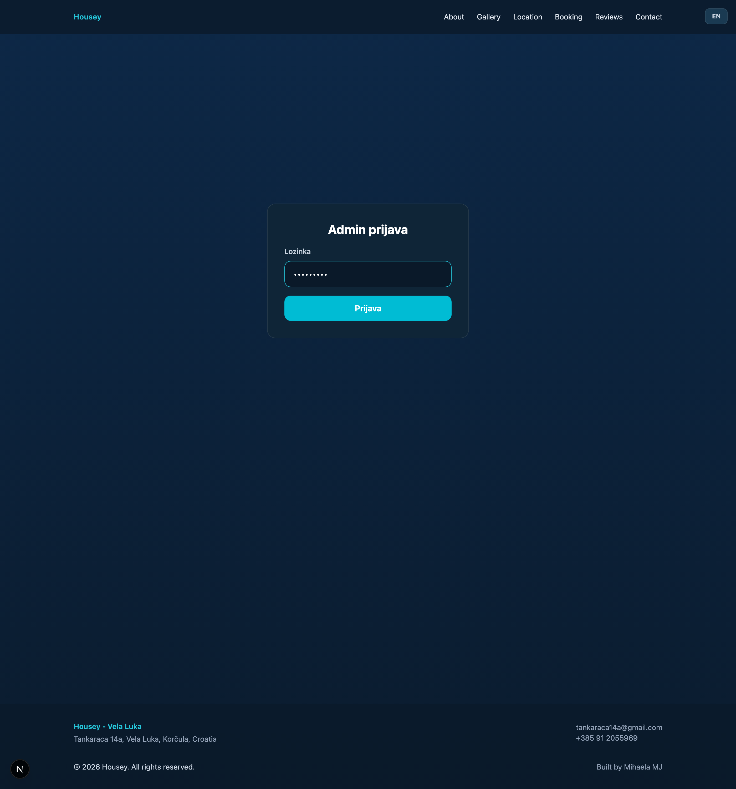

> **Savjet:** Stranica zna na kojem ste jeziku. U gornjem desnom kutu je mali **HR/EN** gumb — kliknite ga za prebacivanje između hrvatskog i engleskog u svakom trenutku.

---

## 2. Admin stranica na prvi pogled

Nakon prijave vidjet ćete jednu veliku stranicu s četiri sekcije:

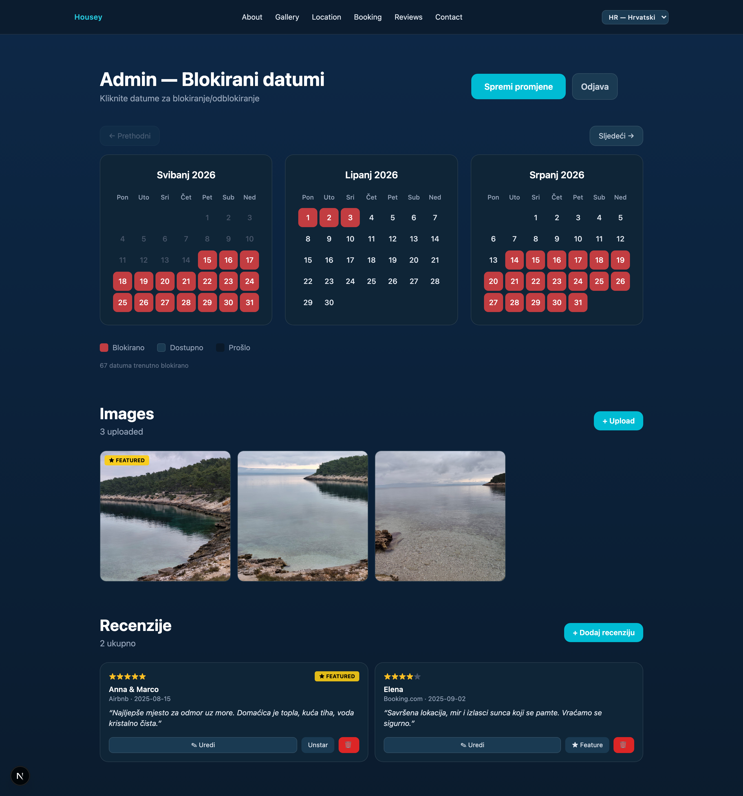

1. **Kalendar na vrhu** — za blokiranje datuma kada ćete vi koristiti kuću.
2. **Slike** — za prijenos i upravljanje fotografijama na javnoj stranici.
3. **Recenzije** (skrolajte dolje) — citati gostiju s ocjenama zvjezdicama, koje objavljujete na javnoj stranici.
4. **Rezervacije** (skrolajte još dalje) — sve rezervacije od gostiju, plus način da sami dodate svoju.

Možete skrolati cijelu stranicu — ništa nije skriveno iza gumba ili izbornika.

---

## 3. Blokiranje vlastitih datuma

Koristite ovo kad **vi** boravite u kući i ne želite da gosti rezerviraju. Datumi koje označite ostaju blokirani dok ih ne uklonite.

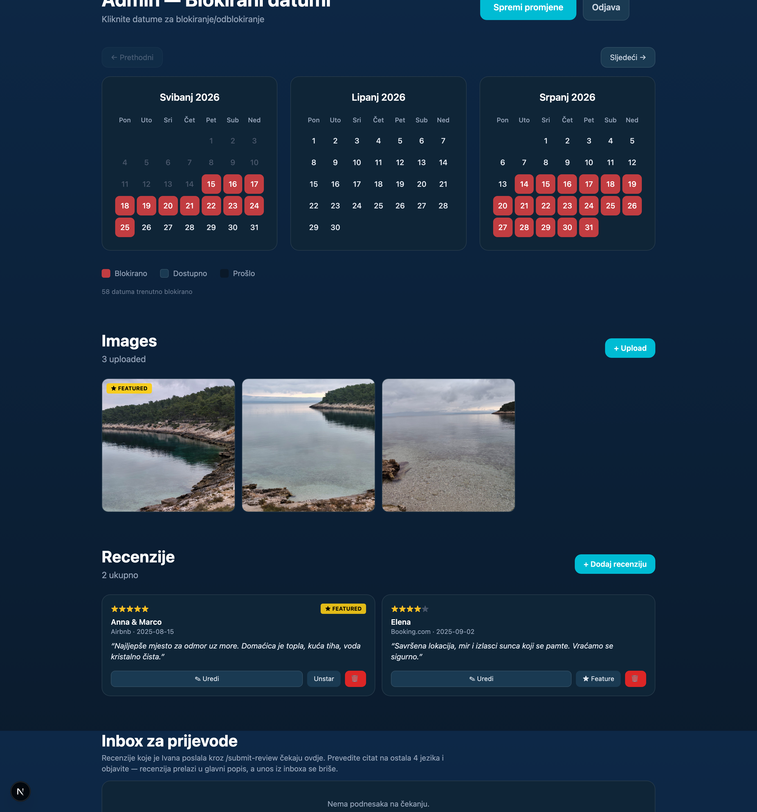

**Za blokiranje datuma:** kliknite bilo koji budući dan. Postaje crven.

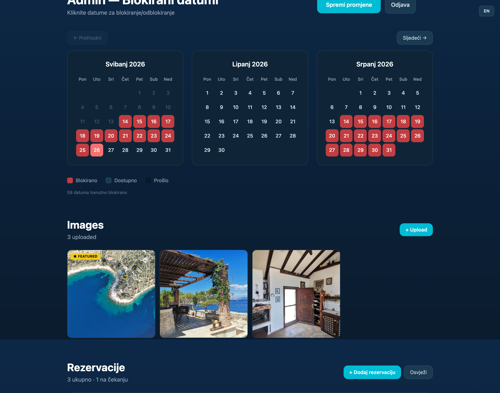

**Za odblokiranje datuma:** kliknite crveni dan. Vraća se u normalno stanje.

**Možete označiti više datuma prije spremanja.** Koristite gumbe **← Prethodni** / **Sljedeći →** za pomicanje kroz mjesece — možete ići onoliko daleko u budućnost koliko trebate.

Kad ste gotovi, kliknite veliki **Spremi promjene** gumb gore desno. Zelena poruka **"Promjene spremljene!"** to potvrđuje:

> **Što gosti vide:** Blokirani datumi se prikazuju precrtano s "Nedostupno" tooltipom na stranici za rezervaciju. Gosti ih ne mogu odabrati.

---

## 4. Rezervacije gostiju

Svaka rezervacija koju gost pošalje preko web stranice završi ovdje, sa statusom **Na čekanju**. Vi odlučujete što se dalje događa.

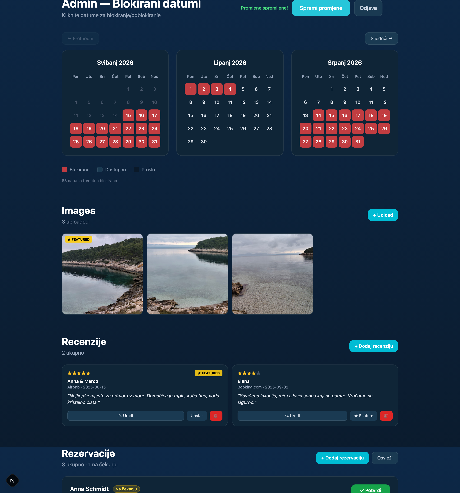

Svaka rezervacija prikazuje:
- **Ime gosta + status oznaku** (Na čekanju / Potvrđeno / Odbijeno)
- **Email** (klikabilan — otvara vašu aplikaciju za email da odgovorite)
- **Telefon**
- **Datume dolaska i odlaska**
- **Broj gostiju**
- **Njihovu poruku za vas**
- **Kad su poslali**

### 4.1 Potvrđivanje rezervacije

Svaka rezervacija na čekanju ima ove gumbe s desne strane:

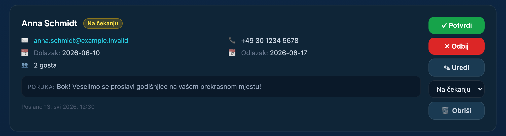

Kliknite zeleni **✓ Potvrdi** gumb da prihvatite rezervaciju.

Vidjet ćete **dva dijaloga za potvrdu jedan za drugim**, da ne možete slučajno potvrditi:

1. *"Potvrditi ovu rezervaciju?"* → kliknite **OK** za nastavak
2. *"Ovo će poslati email gostu da je rezervacija POTVRĐENA i blokirat će datume: [ime gosta + datumi]"* → kliknite **OK** ako ste sigurni

Nakon oba OK-a, redak rezervacije odmah prikazuje **Potvrđeno** (zelena oznaka), gumbi ✓ Potvrdi i ✗ Odbij nestanu, A toast s gumbom **Poništi** se pojavi u donjem desnom kutu s odbrojavanjem od 10 sekundi:

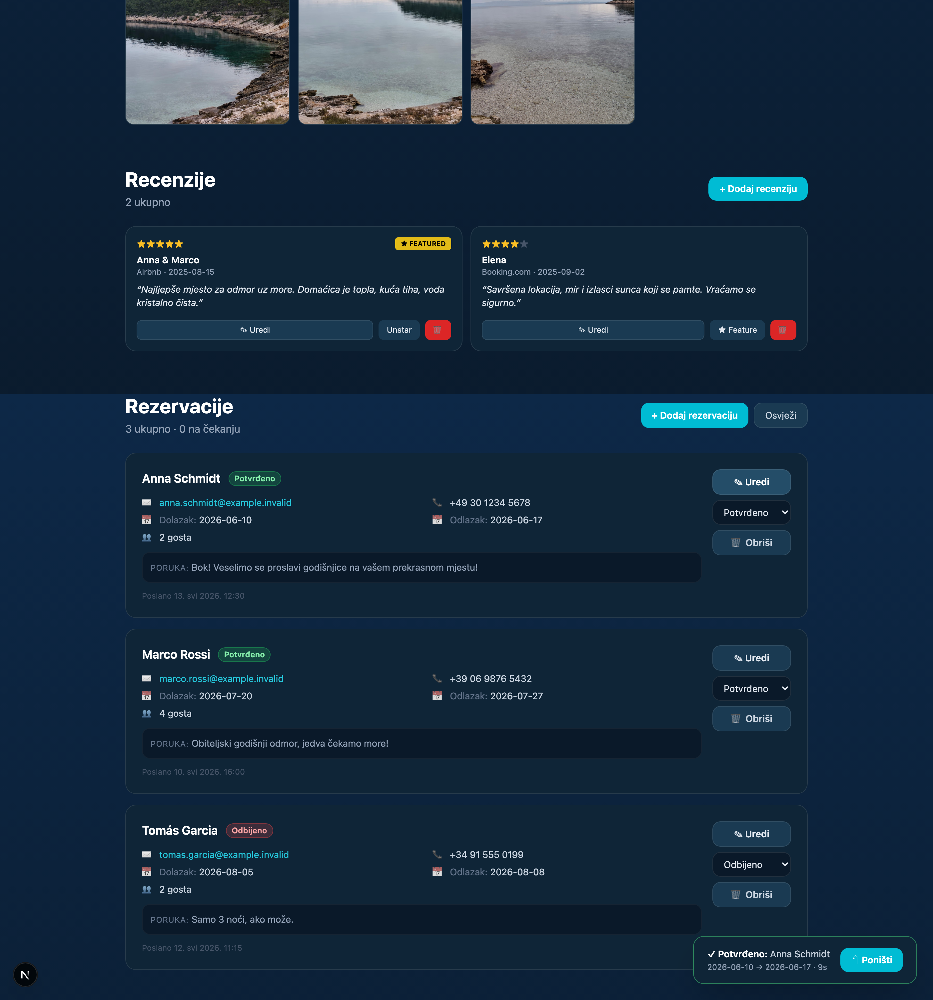

Tijekom tih 10 sekundi, ništa još nije poslano gostu i nijedan datum u kalendaru nije blokiran. Možete:

- **Kliknuti Poništi** unutar 10 sekundi → rezervacija se vraća na Na čekanju, email se ne šalje, datumi se ne blokiraju. Kao da klik nikad nije ni bio.
- **Pričekati 10 sekundi** (ili samo otići) → tada se automatski događaju tri stvari:
  - Status rezervacije se sprema kao **Potvrđeno** na serveru
  - Datumi boravka se dodaju u vaš blokirani kalendar (tako da drugi gost ne može rezervirati iste noći)
  - Email se šalje gostu s potvrdom rezervacije, uključujući vrijeme dolaska/odlaska i adresu

> **Važno:** Jednom kad prođe 10-sekundni prozor, email je poslan i ne može se poništiti. Ako niste sigurni, kliknite Poništi i ponovo pogledajte rezervaciju.

### 4.2 Odbijanje rezervacije

Isti princip, ali kliknite crveni **✗ Odbij** gumb:

1. *"Odbiti ovu rezervaciju?"* → **OK**
2. *"Ovo će poslati email gostu da rezervacija NIJE PRIHVAĆENA: [ime gosta + datumi]"* → **OK**

Redak prikazuje **Odbijeno** (crvena oznaka), gumbi akcije nestanu, A toast s **Poništi** gumbom se pojavi u donjem desnom kutu s odbrojavanjem od 10 sekundi:

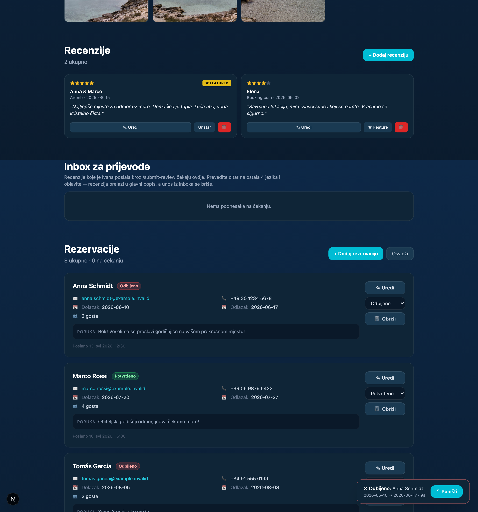

- **Kliknite Poništi unutar 10 sekundi** → vraća se na Na čekanju, email se ne šalje.
- **Pričekajte 10 sekundi** → status se sprema i gost prima pristojan email "ne možemo vas primiti, probajte druge datume".

> Odbijene rezervacije ostaju u listi (da imate evidenciju), ali ne rezerviraju kalendar. Netko drugi može rezervirati iste datume.

### 4.3 Uređivanje detalja rezervacije

Ponekad trebate ispraviti pogrešku u kucanju, pomaknuti datume nakon telefonskog razgovora, ili ažurirati poruku gosta. Kliknite **✎ Uredi** gumb na bilo kojem retku.

Pojavljuje se forma sa svakim poljem koje se može uređivati:

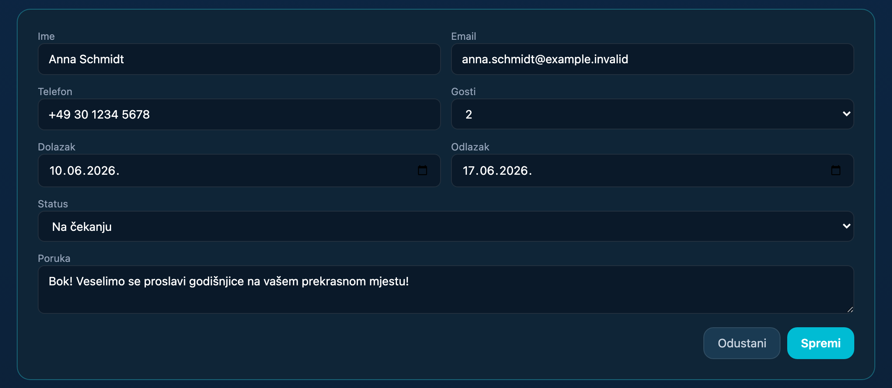

Promijenite što god treba — ime, email, telefon, datume, broj gostiju, status ili poruku — pa kliknite **Spremi**.

> **Poništi:** Nakon spremanja, mali toast se pojavljuje u donjem desnom kutu s gumbom **Poništi**. Imate **10 sekundi** da kliknete ako ste pogrešno spremili — rezervacija se vraća točno onakva kakva je bila. Nakon 10 sekundi, promjena je trajna.

### 4.4 Slobodna promjena statusa

Svaki redak također ima mali dropdown za status:

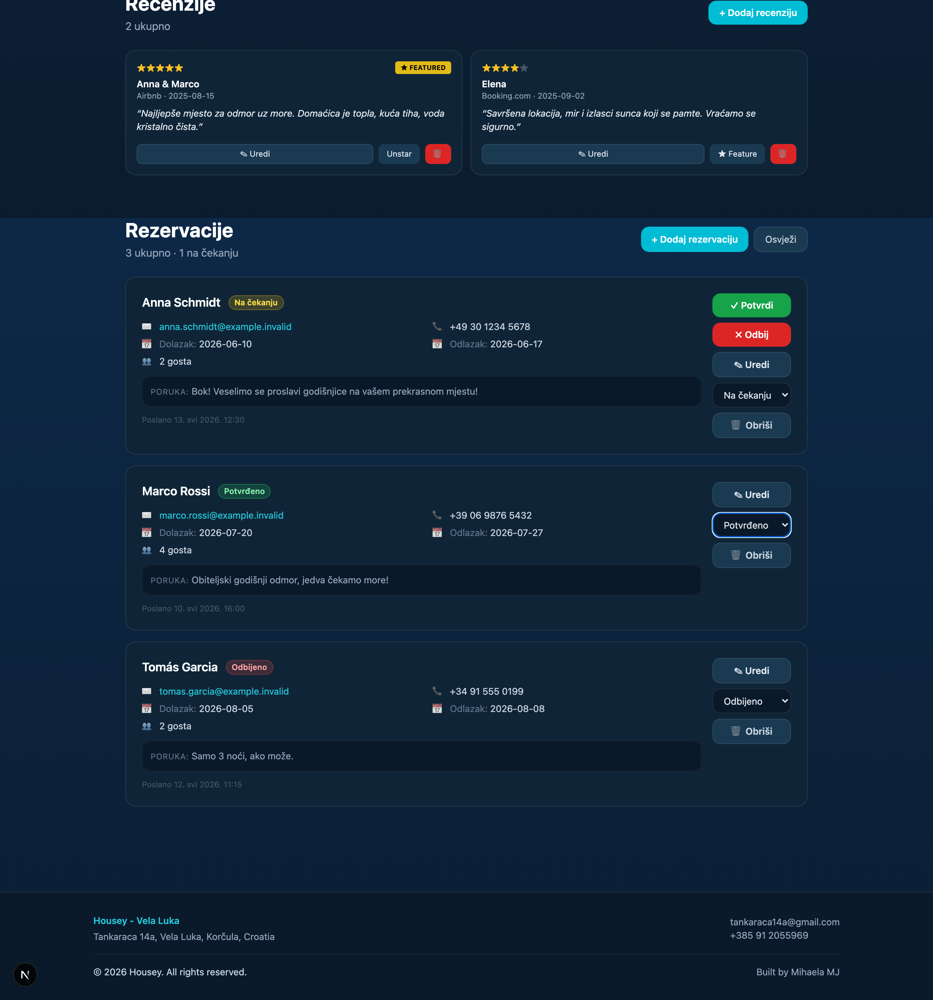

Možete prebaciti bilo koju rezervaciju između Na čekanju / Potvrđeno / Odbijeno u **bilo kojem smjeru** — na primjer, ako ste slučajno potvrdili i želite vratiti na čekanje.

> **Razlika u odnosu na gumb Potvrdi:** Ovaj dropdown samo mijenja status. NE šalje email i NE dira blokirani kalendar. Koristite ga za ispravke; koristite zeleni Potvrdi kad zaista želite obavijestiti gosta.

### 4.5 Dodavanje ručne rezervacije (rezervacije preko telefona)

Kad netko nazove ili pošalje SMS za rezervaciju, kliknite gumb **+ Dodaj rezervaciju** na vrhu sekcije rezervacija.

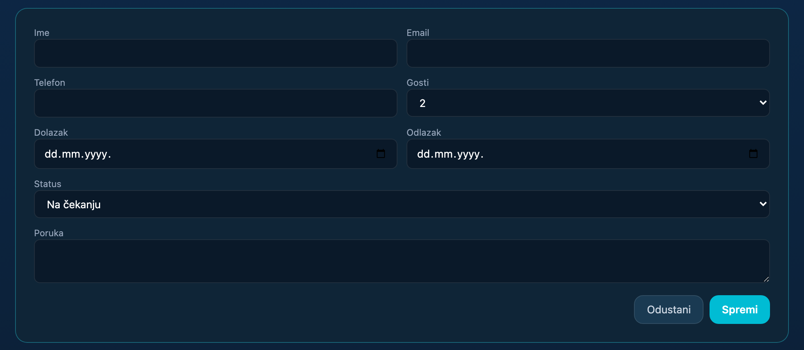

Ispunite sve što znate, odaberite početni status (Na čekanju ako želite kasnije potvrditi, Potvrđeno ako je već sigurno), kliknite **Spremi**.

> Ručne rezervacije ne pokreću email za potvrdu. Ako ipak želite da gost dobije email, pošaljite ga sami ili promijenite status na Na čekanju pa kliknite zeleni **✓ Potvrdi** gumb.

### 4.6 Brisanje rezervacije

🗑 **Obriši** gumb je na svakom retku, neovisno o statusu. Zaštićen je **dvjema potvrdama I 10-sekundnim poništavanjem**:

1. *"Obrisati ovu rezervaciju?"* → **OK**
2. *"Sigurno trajno obrisati rezervaciju za: [ime gosta + datumi]"* → **OK**

Redak odmah nestane iz liste, A toast se pojavi u donjem desnom kutu s odbrojavanjem i gumbom **Poništi**:

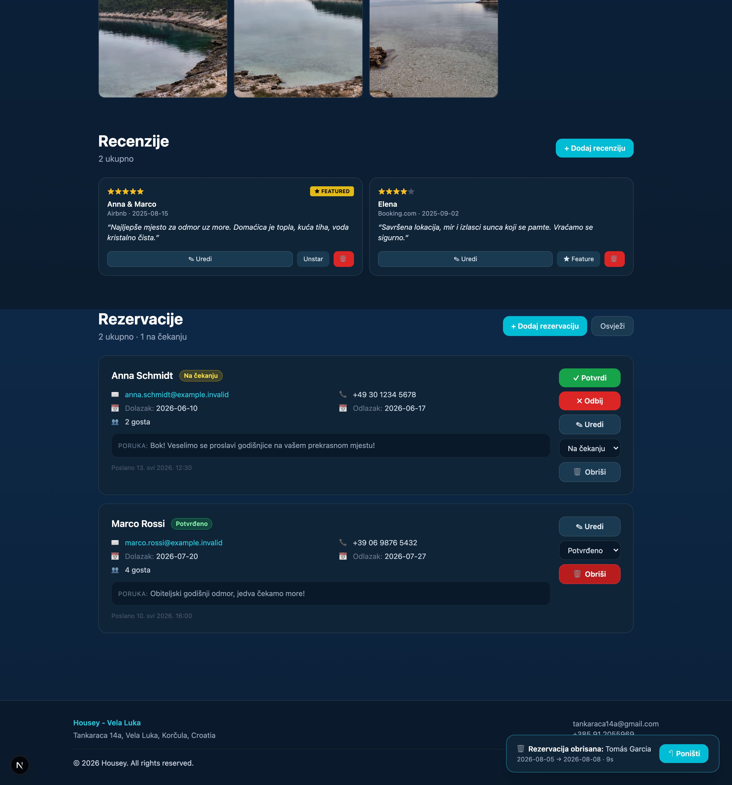

- **Kliknite Poništi unutar 10 sekundi** → rezervacija se vraća, točno onakva kakva je bila. Bez emaila, bez trajne promjene.
- **Pričekajte 10 sekundi** → rezervacija je trajno uklonjena.

> **Važna sitnica:** Ako je rezervacija bila Potvrđena, brisanjem se NE oslobađaju automatski datumi iz kalendara. Ovo je sigurnosna značajka kako pogrešan klik ne bi slučajno ponovno otvorio noći platežnog gosta. Da oslobodite datume: kliknite ih u kalendaru na vrhu stranice i Spremi promjene.

---

## 5. Slike

Slike koje prenesete ovdje automatski se pojavljuju na vašoj javnoj stranici **/gallery** unutar nekoliko sekundi. Bez promjena u kodu, bez čekanja na programera.

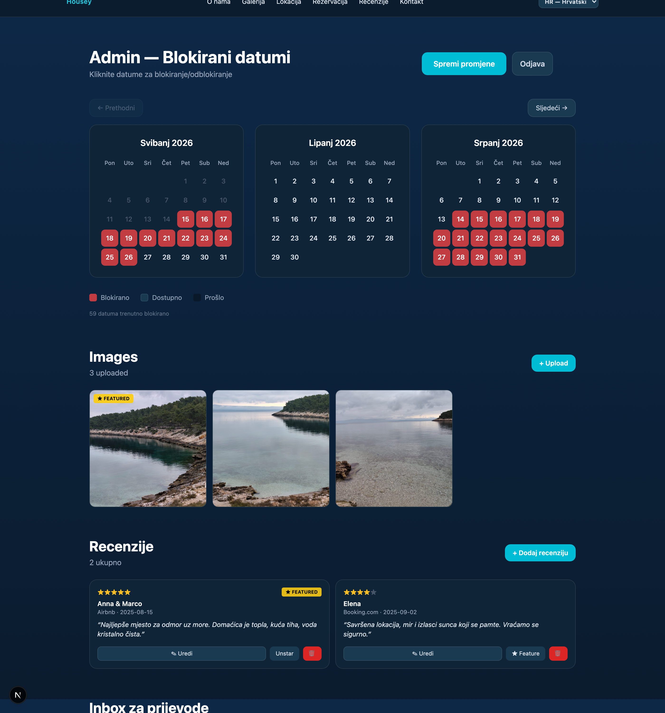

### 5.1 Prijenos fotografija

Kliknite plavi **+ Upload** gumb.

Otvara se odabir datoteka. Možete:
- Odabrati **jednu fotografiju ili više** odjednom (držite Cmd/Ctrl dok klikate)
- Prenijeti **JPEG, PNG, WebP ili HEIC** (HEIC je ono što iPhone proizvodi — automatski se konvertira u JPEG u vašem pregledniku, ne morate ništa raditi)
- Datoteke do **12 MB svaka** su prihvaćene

Brojač pokazuje "uploading N..." dok se fotografije prenose. Kad brojač dođe na 0, fotografije su uživo.

### 5.2 Označavanje fotografija kao istaknute

Pređite mišem preko bilo koje fotografije da otkrijete gumbe za akcije:

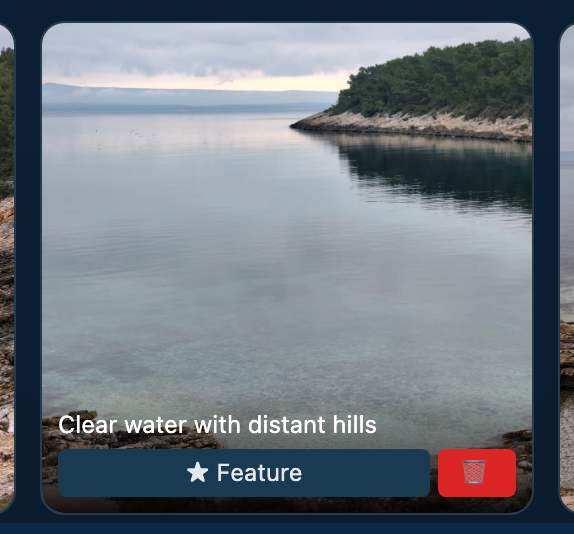

Kliknite **★ Feature** da označite. Istaknute fotografije dobivaju žutu ★ FEATURED oznaku.

> **Napomena o istaknutim fotografijama:** Galerija trenutno prikazuje prve 3 istaknute fotografije u "hero" izgledu, a ostale u glavnoj mreži. Ako imate puno istaknutih, samo prve 3 dobivaju hero tretman.

Kliknite **Unstar** za uklanjanje oznake.

### 5.3 Brisanje fotografija

Kliknite 🗑 ikonu kante na bilo kojoj fotografiji. Vidjet ćete dvije potvrde:

1. *"Obrisati ovu fotografiju?"* → **OK**
2. *"Sigurno obrisati ovu fotografiju?"* → **OK**

Fotografija odmah nestane iz mreže, A toast s gumbom **Poništi** se pojavi u donjem desnom kutu s odbrojavanjem od 10 sekundi, jednako kao kod brisanja rezervacije:

- **Kliknite Poništi unutar 10 sekundi** → fotografija se vraća, ništa se nije promijenilo.
- **Pričekajte 10 sekundi** → fotografija je trajno uklonjena (bytes su uklonjeni iz spremišta).

> Ako slučajno kliknete 🗑 i ne vidite toast odmah, skrolajte do donjeg desnog kuta stranice, tu se nalazi gumb Poništi.

---

## 6. Recenzije gostiju

Recenzije su pravi citati ljudi koji su odsjeli u kući. Vi ih kopirate odakle god su stigle (Airbnb, Booking.com, privatna poruka, e-mail) i pojavljuju se na vašoj **/reviews** stranici na javnom sajtu. Sve što označite kao **Featured** također se prikazuje na početnoj stranici, pa je to prvo što novi posjetitelji vide.

Vi ste jedina osoba koja može dodavati ili uređivati recenzije. Gosti NE pišu recenzije na samoj stranici, i dalje ih ostavljaju na Airbnbu / Bookingu / Googleu kao i prije. Vi birate koje od njih objaviti ovdje.

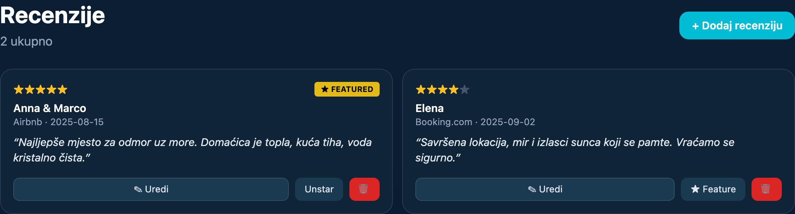

### 6.1 Dodavanje recenzije

Skrolajte do sekcije **Recenzije** (smještena je između Slika i Rezervacija) i kliknite plavi gumb **+ Dodaj recenziju**. Pojavi se obrazac:

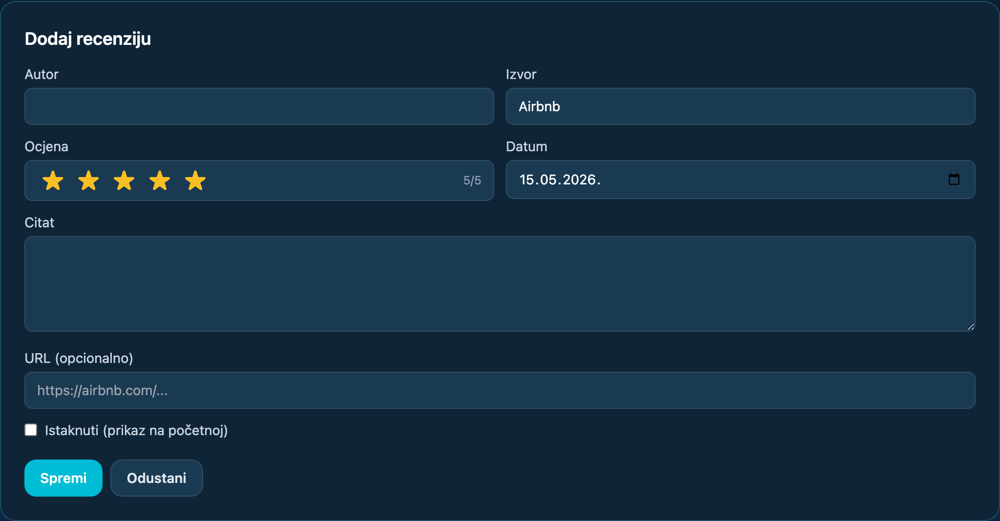

Popunite:

- **Autor** — ime gosta i početno slovo prezimena (npr. `Ana M.` ili `Anna & Marco`). Neka bude kratko, ovo je sve što se prikazuje na javnoj stranici.
- **Izvor** — odakle je recenzija. Slobodan tekst, upišite što vam pomaže zapamtiti: `Airbnb`, `Booking.com`, `Direkt`, `WhatsApp`, `Email`, `Google`. Polje je prepunjeno s `Airbnb`, prepišite po potrebi.
- **Ocjena** — pogledajte 6.2 ispod.
- **Datum** — datum kada je gost ostavio recenziju. Već popunjen današnjim datumom, promijenite ako se sjećate izvornog datuma.
- **Citat** — zalijepite tekst recenzije točno onako kako ga je gost napisao. Najbolje radi jedna ili dvije rečenice, dugi paragrafi se odsijeku na mobitelu.
- **URL (opcionalno)** — ako je recenzija objavljena online (Airbnb, Google), zalijepite link ovdje. Slobodno možete ostaviti prazno.
- **Istaknuti (prikaz na početnoj)** — označite kvačicom ako želite da se recenzija prikaže na vašoj početnoj stranici. Najbolje za vaše apsolutne favorite, početna stranica prikazuje samo nekoliko.

Kliknite **Spremi**. Recenzija se odmah pojavi u popisu iznad (i na javnoj stranici unutar nekoliko sekundi).

### 6.2 Postavljanje ocjene zvjezdicama

Ocjenu postavljate klikom na zvjezdice. **Nova recenzija počinje s 5 zvjezdica** (najvišom). Za nižu ocjenu, kliknite zvjezdicu na poziciji koju želite:

- Kliknite **3. zvjezdicu** → dobivate ocjenu 3 (3 žute, 2 sive)
- Kliknite **1. zvjezdicu** → ocjena 1 (1 žuta, 4 sive)
- Kliknite **5. zvjezdicu** → opet 5

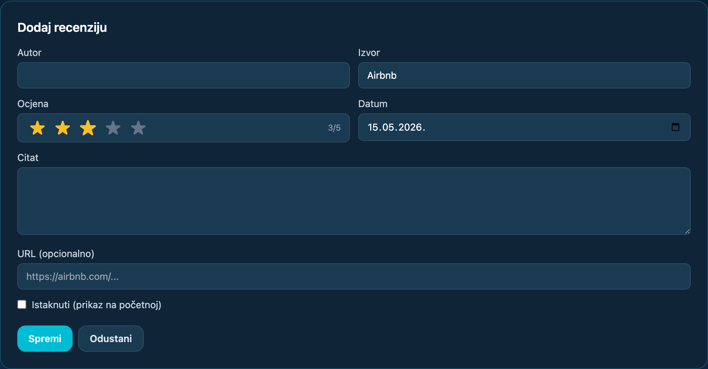

Mala oznaka **"3/5"** desno uvijek potvrđuje trenutnu vrijednost. Kliknite bilo koju zvjezdicu bilo kada za promjenu, možete podešavati dok ne izgleda kako treba.

> **Za Booking.com recenzije:** njihove ocjene idu od 1 do 10. Podijelite s 2 i normalno zaokružite, `9` postaje 5 zvjezdica ovdje, `8` postaje 4, `7` postaje 4 (zaokružite naviše ako broj završava na `.5`).

### 6.3 Označavanje recenzije kao istaknute

Svaka pločica recenzije ima tri gumba na dnu: **✎ Uredi**, **★ Feature** (ili **Unstar** ako je već istaknuta), i **🗑** (brisanje).

Kliknite **★ Feature** da stavite recenziju na početnu stranicu. Istaknute recenzije:

- dobivaju malu žutu **★ FEATURED** oznaku na pločici u admin pogledu
- prikazuju se na početnoj stranici u kratkom redu kartica iznad podnožja
- i dalje se pojavljuju na cijeloj **/reviews** stranici

Početna stranica prikazuje prve tri istaknute recenzije. Ako označite više od tri kao istaknute, dodatne se vide samo na /reviews stranici.

Kliknite **Unstar** na istaknutoj recenziji da je maknete s početne stranice. Sama recenzija ostaje, miče se samo s početne stranice.

### 6.4 Uređivanje recenzije

Kliknite **✎ Uredi** na bilo kojoj pločici recenzije. Otvara se isti obrazac, prepunjen s onim što ste izvorno spremili. Promijenite što god (i zvjezdice, kliknite drugu zvjezdicu za promjenu ocjene). Kliknite **Spremi** — recenzija se odmah ažurira, javna stranica se osvježi unutar nekoliko sekundi.

Kliknite **Odustani** ako ste otvorili greškom, ništa se ne sprema.

### 6.5 Brisanje recenzije

Kliknite crveni gumb **🗑** na pločici recenzije.

Vidjet ćete jednu potvrdu: *"Obrisati recenziju od [autor]?"* → **OK**.

Recenzija **odmah** nestane iz popisa, a toast s gumbom **Poništi** se pojavi u donjem desnom kutu s odbrojavanjem od 10 sekundi, jednako kao kod rezervacija i fotografija:

- **Kliknite Poništi unutar 10 sekundi** → recenzija se vraća, ništa se nije promijenilo.
- **Pričekajte 10 sekundi** → recenzija je trajno uklonjena.

> Ako slučajno kliknete 🗑 i ne vidite toast odmah, skrolajte do donjeg desnog kuta stranice, tu se nalazi gumb Poništi.

### 6.6 Recenzije na arapskom, hebrejskom, perzijskom ili drugim pismima koja se čitaju zdesna nalijevo

Ako vam gost ostavi recenziju na arapskom, hebrejskom, perzijskom ili bilo kojem drugom pismu koje se čita zdesna nalijevo, **samo je zalijepite kao i bilo koju drugu**. Obrazac automatski prepoznaje smjer dok lijepite, pa će se tekst poravnati desno u poljima Autor i Citat, točno kako će izgledati na javnoj stranici.

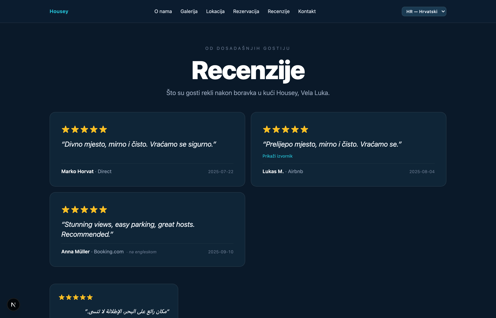

Na javnoj stranici **/reviews** svaka pločica se preokreće neovisno:

- Engleska, hrvatska ili talijanska recenzija ostaje poravnata lijevo, otvarajući navodnik na lijevoj strani.
- Arapska, hebrejska ili perzijska recenzija se preokreće desno, otvarajući navodnik na desnoj strani.
- Mješoviti citat (arapska recenzija koja spominje "Airbnb" latinicom, na primjer) također ispravno teče, preglednik se sam pobrine.

Nema ničega za uključiti, nema postavke za zapamtiti. Zalijepite tekst točno onako kako ga je gost napisao i kliknite **Spremi**.

---

## 7. Prebacivanje jezika

U gornjem desnom kutu svake stranice (admin i javne stranice) nalazi se mali **izbornik jezika** (dropdown). Prvi put kad se otvori stranica, prikazuje se na **engleskom**. Kliknite izbornik i odaberite jezik:

- **EN — English** (zadano)
- **HR — Hrvatski**
- **DE — Deutsch**
- **IT — Italiano**
- **FR — Français**

Vaš izbor se pamti na vašem uređaju (prelazi između stranica i preko browser sesija), pa kad odaberete hrvatski ostajete na hrvatskom dok ponovno ne promijenite. Gosti imaju vlastiti pamćeni izbor na svom uređaju.

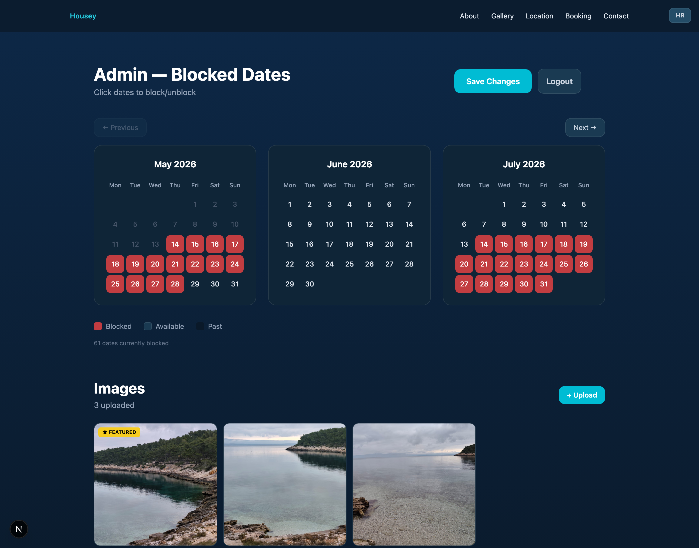

Sve — oznake u kalendaru, tekst gumba, oznake statusa, dijalozi za potvrdu — prilagođava se odabranom jeziku.

---

## 8. Odjava

Kliknite **Odjava** gumb (gornji desni kut).

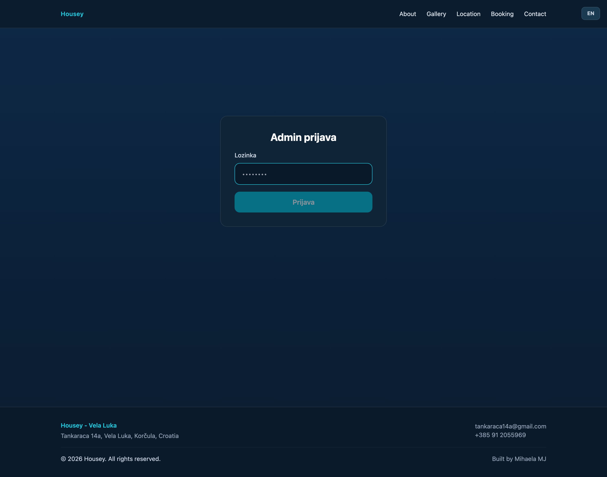

Ovo briše vašu lozinku iz memorije preglednika. Korisno ako ste na zajedničkom računalu.

> **Zatvaranje kartice preglednika** vas također odjavljuje — vaša lozinka se nikad ne sprema na disk.

---

## 9. Što učiniti ako nešto pođe po zlu

### "Kliknula sam Potvrdi na pogrešnu rezervaciju"

- **Unutar 10 sekundi:** kliknite **Poništi** gumb u toastu u donjem desnom kutu. Email se ne šalje. Datumi se ne blokiraju. Rezervacija se vraća na Na čekanju.
- **Nakon 10 sekundi (email je već otišao):**
  - Gost već ima email s potvrdom. Ne možete ga povući.
  - Pošaljite mu email izravno iz vašeg inboxa (mailto link je na retku rezervacije) i objasnite.
  - Koristite **status dropdown** da prebacite rezervaciju natrag na Na čekanju ili Odbijeno.
  - Datumi koji su se automatski blokirali kad ste potvrdili će i dalje biti blokirani. Kliknite ih u kalendaru na vrhu i Spremi promjene.

### "Kliknula sam Odbij na pogrešnu"

- **Unutar 10 sekundi:** kliknite **Poništi** gumb u toastu u donjem desnom kutu. Email se ne šalje.
- **Nakon 10 sekundi:** pošaljite gostu email izravno da se ispričate, pa koristite status dropdown da ih vratite na Na čekanju.

### "Slučajno sam obrisala rezervaciju"

- **Unutar 10 sekundi:** kliknite gumb **Poništi** u toastu u donjem desnom kutu.
- **Nakon 10 sekundi:** rezervacija je nestala. Pitajte gosta da ponovno pošalje preko stranice, ili koristite **+ Dodaj rezervaciju** za ručni unos iz emaila/bilješki.

### "Slučajno sam blokirala krivi datum"

- Kliknite ponovno na crveni datum u kalendaru — postaje proziran.
- Kliknite **Spremi promjene**. To je sve.

### "Prenijela sam krivu fotografiju"

- Pređite mišem preko fotografije, kliknite 🗑, prođite kroz obje potvrde.
- Fotografija nestane, toast s **Poništi** gumbom se pojavi u donjem desnom kutu s odbrojavanjem od 10 sekundi.
- Pričekajte 10 sekundi → trajno je obrisana.
- Kliknite Poništi unutar 10 sekundi → vraća se.

### "Slučajno sam obrisala krivu fotografiju"

- **Unutar 10 sekundi:** kliknite **Poništi** gumb u toastu u donjem desnom kutu.
- **Nakon 10 sekundi:** bytes fotografije su otišli iz spremišta. Morate ponovno prenijeti s telefona.

### "Slučajno sam obrisala krivu recenziju"

- **Unutar 10 sekundi:** kliknite **Poništi** gumb u toastu u donjem desnom kutu.
- **Nakon 10 sekundi:** recenzija je trajno uklonjena. Pronađite izvornik (Airbnb / Booking / email) i ponovno je dodajte preko **+ Dodaj recenziju**, kopirajte i zalijepite isti citat.

### "Dala sam recenziji krivi broj zvjezdica"

- Kliknite **✎ Uredi** na pločici recenzije, kliknite na ispravnu zvjezdicu (npr. 4. zvjezdicu za ocjenu 4), kliknite **Spremi**. Javna stranica se osvježi unutar nekoliko sekundi.

### "Stranica se ne učitava / nešto izgleda neispravno"

- Osvježite stranicu (Cmd/Ctrl + R).
- Ako ste odjavljeni nakon osvježavanja, prijavite se ponovno — vaše neslspremljene izmjene su izgubljene, ali spremljeni podaci su sigurni.
- Ako gumb ne radi ništa kad ga kliknete, pričekajte 5 sekundi — server može biti spor.
- Ako nešto stalno ne radi, zapišite što se dogodilo (koji gumb, što ste vidjeli) i vrijeme, i javite Mihaeli.

### "Gost kaže da nije dobio email s potvrdom"

- Provjerite oznaku statusa rezervacije — ako je još **Na čekanju**, nikad niste kliknuli Potvrdi (samo Potvrdi šalje email; status dropdown ne šalje).
- Ako je status **Potvrđeno**, email je poslan. Pitajte gosta da provjeri spam folder. Email dolazi s adrese `noreply@tankaraca.com`.

---

## Od čega vas sustav štiti

Ne morate ovo pamtiti — admin stranica ovo automatski provodi:

- **Dvostruke rezervacije:** Ako dva gosta pošalju preklapajuće datume, drugi se odbije s jasnom porukom. Nikad ne završe oba kao na čekanju.
- **Pogrešni klikovi na destruktivne radnje:** Potvrdi, Odbij i Obriši svaki zahtijevaju dva klika kroz dijaloge za potvrdu.
- **Trajni gubitak zbog pogreške:** Potvrda rezervacije, Odbijanje, Brisanje, Uređivanje, Brisanje fotografije I Brisanje recenzije svako imaju 10-sekundno poništavanje. Toast se pojavi u donjem desnom kutu zaslona.
- **Email poslan slučajno:** Emailovi za Potvrdi i Odbij se NE šalju dok ne prođe 10-sekundni prozor poništavanja. Kliknite Poništi i email nikad neće biti poslan, gost nikad neće znati.
- **Gubljenje nespremljenih izmjena kalendara:** Ako ste označili neke datume i zaboravili kliknuti Spremi promjene, stranica pita "imate nespremljene promjene, stvarno odustati?" prije nego što vam dopusti da se odjavite, osvježite ili zatvorite karticu.
- **Izgubljene rezervacije zbog problema s emailom:** Rezervacije se spremaju u bazu PRIJE nego što email ode. Ako email ne uspije iz bilo kojeg razloga, rezervacija je još uvijek tamo i vidite je u listi.

---

## Što još nije u ovom vodiču (za sada)

Postoji na listi zadataka kao GitHub issues — ništa od ovoga vas ne sprječava da vodite stvari danas:

- **Instagram / Facebook linkovi** ([#2](https://github.com/tankaraca14a/housey/issues/2)) — kad napravite račune, javite Mihaeli URL-ove.
- **Više istaknutih fotografija vidljivo odjednom** ([#7](https://github.com/tankaraca14a/housey/issues/7)) — trenutno samo prve 3 istaknute fotografije dobivaju hero pozicije.
- **Vaši zapisi (Priče / Dnevnik / Novosti)** ([#8](https://github.com/tankaraca14a/housey/issues/8)) — sekcija gdje objavljujete kratke vijesti iz kuće (berba maslina, temperatura mora, recepti). Uređuje se kroz admin.
- **FAQ sekcija (pitanja i odgovori)** ([#10](https://github.com/tankaraca14a/housey/issues/10)) — admin-uređeni parovi pitanja+odgovora (wifi, vrijeme dolaska, parking, doručak…) tako da gosti ne pišu ista pitanja stalno.
- **Kućni red** ([#11](https://github.com/tankaraca14a/housey/issues/11)) — jedna markdown stranica koju sami uređujete.
- **Prikaz cijene** ([#12](https://github.com/tankaraca14a/housey/issues/12)) — "od €X / noć" prikazano prije nego gost pošalje formu, s opcionalnom sezonskom razlikom.
- **Što vidjeti u blizini** ([#13](https://github.com/tankaraca14a/housey/issues/13)) — vaš odabir lokalnih restorana, plaža, šetnji, vidikovaca. Razlika od običnih najmova.
- **Newsletter za bivše goste** ([#14](https://github.com/tankaraca14a/housey/issues/14)) — način da povremeno pošaljete email gostima koji su već boravili ("masline su zrele", "jesenska cijena spuštena").
- **Ispisivi info kartica PDF** ([#15](https://github.com/tankaraca14a/housey/issues/15)) — jedna stranica PDF-a koju zalijepite na hladnjak: wifi lozinka, upute za odjavu, brojevi taksija, QR kod za vodič o okolici.

---

*Posljednje ažuriranje: ovaj dokument i njegovi screenshotovi su ponovno generirani pokretanjem `node scripts/generate-admin-guide-screenshots-hr.mjs` nad lokalnom kopijom housey admin stranice. Ako nešto ikad izgleda drugačije od onoga što je prikazano ovdje, sama stranica je izvor istine.*
